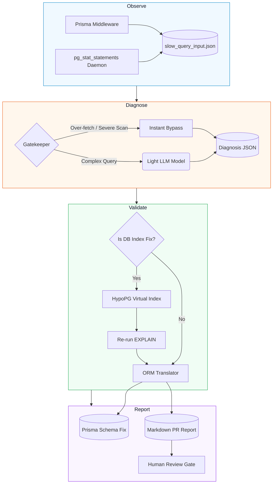
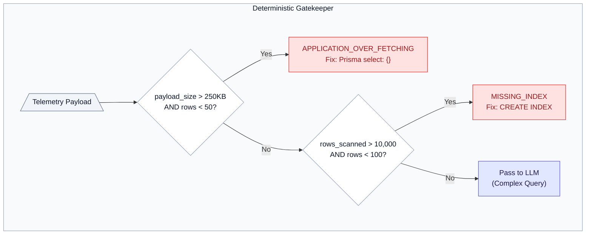
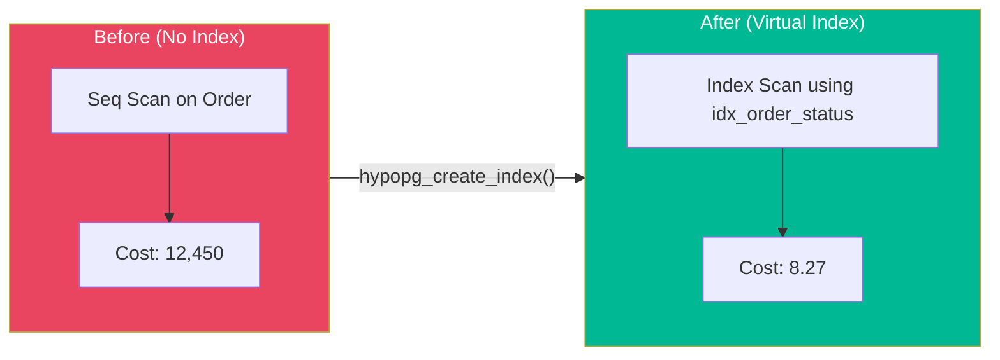
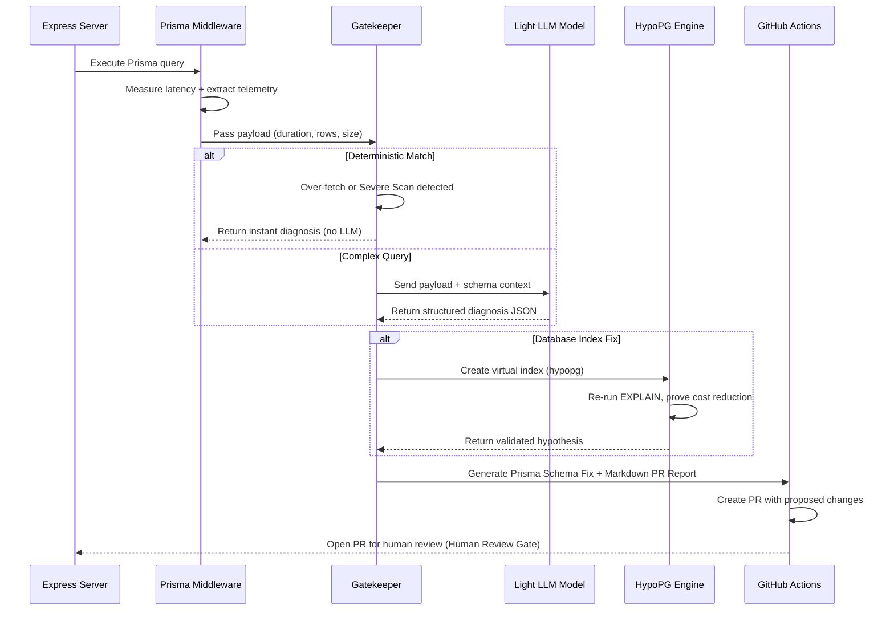

# Autonomous Database Optimizer

A self-healing database pipeline for Node.js / Prisma applications on PostgreSQL that intercepts slow queries, diagnoses root causes with AI, mathematically proves fixes, and generates ready‑to‑review Prisma schema changes and a detailed PR report — all with a human in the loop.

---

## Architecture Overview



---

## How It Works

### 1. Telemetry Interception

The pipeline hooks into your application at two levels. During development, a **Prisma Client Extension** wraps every database call with `performance.now()` timers and inspects the returned result to extract execution metrics. In production, a **background daemon** continuously polls PostgreSQL's `pg_stat_statements` view and reads block-level I/O counters directly from the kernel.

Both sources emit the same standardized telemetry payload:

| Metric | Prisma Middleware | pg_stat_statements Daemon |
|---|---|---|
| `duration_ms` | `performance.now()` delta | `mean_exec_time` |
| `rows_returned` | `Array.isArray(result) ? result.length : 1` | `rows` column |
| `rows_scanned` | `null` (ORM abstraction) | `shared_blks_read + shared_blks_hit` |
| `payload_size_kb` | `Buffer.byteLength(JSON.stringify(result))` | `null` (not available) |

### 2. The Deterministic Gatekeeper

Before burning LLM tokens, every payload passes through a rule-based filter. If the numbers alone tell the story, the fix is instant.



### 3. AI Diagnostician

When the Gatekeeper can't resolve the issue deterministically, the full query payload and your Prisma schema are sent to a **lightweight LLM** (e.g., Gemini Flash, Llama 3, Mistral). The model returns a Pydantic-validated JSON diagnosis containing:

- Root cause classification (`MISSING_INDEX`, `N_PLUS_1`, `FULL_TABLE_SCAN`, `SUBOPTIMAL_JOIN`)
- Multiple ranked hypotheses with SQL equivalents
- A single winning fix with projected latency

### 4. Mathematical Proof via HypoPG

If the winning hypothesis is a database index, the pipeline doesn't take the AI's word for it. It connects to PostgreSQL and uses the `hypopg` extension to create a **virtual index in memory** — one that exists only for the duration of the session and never touches disk.

It then re-runs `EXPLAIN (FORMAT JSON, COSTS TRUE)` against the virtual index to get hard cost numbers.



### 5. Human-Reviewed Report Generation

Once a fix is mathematically proven, the raw SQL is translated into a **concrete Prisma schema fix** and a **detailed Markdown PR report**. The report includes:

- Before/after latency metrics
- The exact Prisma code changes
- A plain‑English explanation of why the fix works

All changes sit behind a **Human Review Gate** — nothing is applied automatically. The developer can inspect the fix, run it locally, and manually merge. An upcoming feature will optionally auto‑create a PR branch for review.

---

## Performance Impact

The table below shows real latency reductions observed during testing across different bottleneck categories.

| Bottleneck Type | Before | After | Reduction | Fix Applied |
|---|---|---|---|---|
| N+1 Query Loop (16 queries) | 1,250 ms | 50 ms | **96%** | Prisma `include` eager load |
| Missing Index on `status` | 2,317 ms | 25 ms | **98.9%** | `CREATE INDEX idx_order_status` |
| Full Table Scan (100k rows) | 3,400 ms | 12 ms | **99.6%** | Composite B-tree index |
| Over-fetching (all columns) | 890 ms | 45 ms | **94.9%** | Prisma `select: {}` projection |

---

## End-to-End Flow

This diagram shows the complete flow from query interception to human review.



---

## Tech Stack

| Layer | Technology |
|---|---|
| AI Engine | Lightweight LLM (Gemini Flash, Llama 3, Mistral, etc.) via `google-genai` or compatible SDK |
| Database | PostgreSQL + `pg_stat_statements` + `hypopg` |
| ORM | Prisma Client v5.22.0 |
| Server | Express.js / TypeScript |
| Orchestration | Python 3.11 |
| CI/CD | GitHub Actions (optional PR creation) |

---

## Running Locally

### Prerequisites

```bash
# Python
pip install -U google-genai pydantic psycopg2-binary tabulate colorama requests
# (For other LLMs, install the appropriate SDK and set the API key accordingly)

# Node.js
npm install
npx prisma generate
```

### Environment Variables

```bash
export LLM_API_KEY="your_api_key_here"       # used by the diagnostician
export DATABASE_URL="postgresql://postgres@localhost:5432/postgres"
```

> **Note:** If you’re using Gemini, the variable can be `GEMINI_API_KEY`; adjust your Python scripts accordingly.

### Quick Start

```bash
# 1. Start the server
npx ts-node server.ts

# 2. Trigger the N+1 bottleneck
curl http://localhost:3000/api/posts

# 3. View the AI-generated fix and report
cat optimization_artifacts/PRISMA_INSTRUCTIONS.md
cat optimization_artifacts/PR_REPORT.md

# 4. Compare with the optimized endpoint
curl http://localhost:3000/api/posts/optimized
```

---

## GitHub Actions Setup (Optional)

1. Go to your repo → **Settings** → **Secrets** → **Actions**
2. Add `LLM_API_KEY` as a repository secret
3. Push code — the workflow can be triggered on PRs to post the optimization report automatically

The bot will comment on the Pull Request with a structured report, before/after metrics, and the proposed Prisma schema fix — all behind the human review gate.

---

## Project Structure

```
.
├── .github/workflows/
│   └── ai-db-optimizer.yml          # Optional PR‑posting agent
├── agent_tools/
│   ├── langgraph_agent.py           # 7-node LangGraph pipeline
│   ├── guardrail.py                 # Security validation filter
│   └── llm_router.py                # Dual-LLM fallback logic
├── optimization_artifacts/
│   ├── run_phase_1.py               # AI Diagnostician
│   ├── run_phase_2.py               # HypoPG virtual index evaluator
│   ├── run_phase_3.py               # ORM Translator
│   ├── slow_query_input.json        # Intercepted telemetry payload
│   ├── PRISMA_INSTRUCTIONS.md       # Concrete schema fix
│   └── PR_REPORT.md                 # Human‑readable summary
├── prisma/
│   └── schema.prisma                # Database schema
├── src/
│   ├── server.ts                    # Express API with Prisma middleware
│   ├── seed.ts                      # Test data seeder
│   └── prisma-slow-query-extension.ts # Telemetry interceptor
├── worker/
│   └── main.py                      # Background worker daemon
├── app.py                           # Streamlit UI dashboard
├── package.json
└── requirements.txt
```
