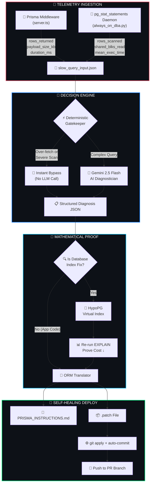
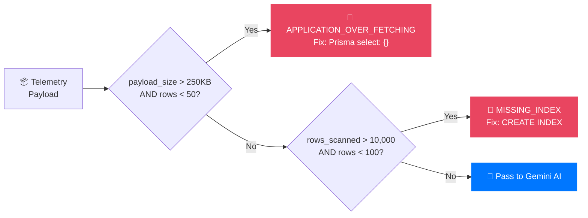
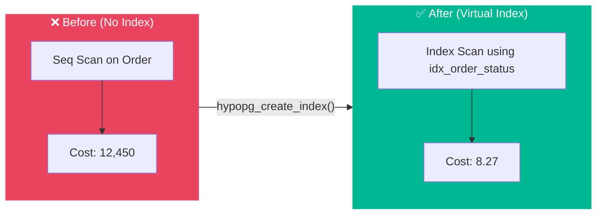
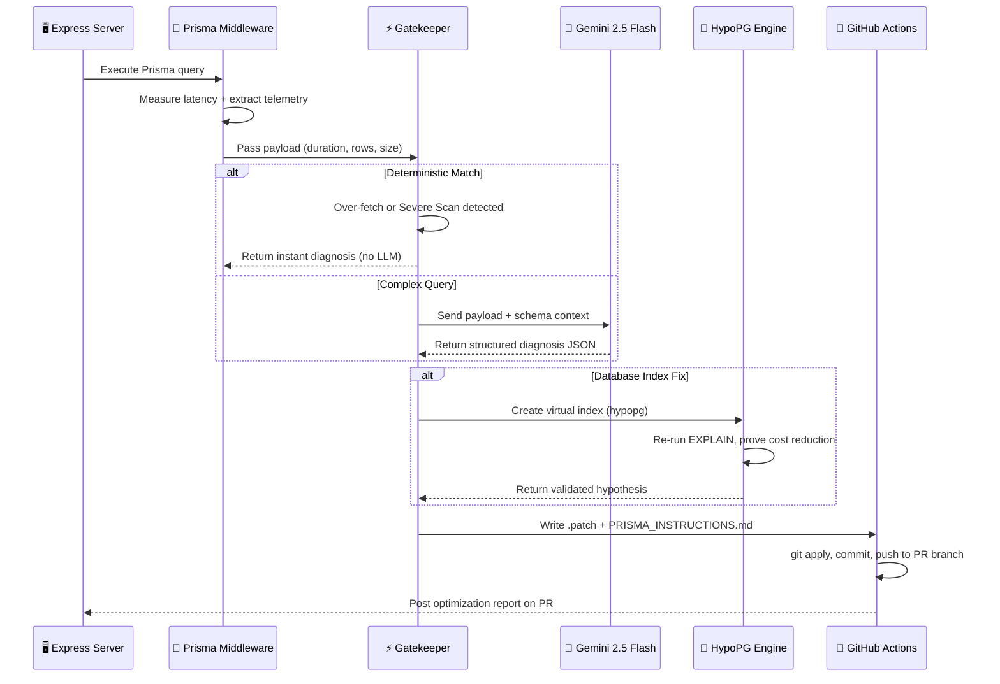

<!-- ╔══════════════════════════════════════════════════════════════════════╗ -->
<!-- ║           AUTONOMOUS DATABASE OPTIMIZER — PROJECT README            ║ -->
<!-- ╚══════════════════════════════════════════════════════════════════════╝ -->


<div align="center">

<br/>

```
    ╔═══════════════════════════════════════════════════════════════╗
    ║                                                               ║
    ║     █████╗ ██╗   ██╗████████╗ ██████╗                        ║
    ║    ██╔══██╗██║   ██║╚══██╔══╝██╔═══██╗                       ║
    ║    ███████║██║   ██║   ██║   ██║   ██║                       ║
    ║    ██╔══██║██║   ██║   ██║   ██║   ██║                       ║
    ║    ██║  ██║╚██████╔╝   ██║   ╚██████╔╝                       ║
    ║    ╚═╝  ╚═╝ ╚═════╝    ╚═╝    ╚═════╝                        ║
    ║                                                               ║
    ║        D A T A B A S E    O P T I M I Z E R                  ║
    ║             ── Self-Healing Query Pipeline ──                 ║
    ║                                                               ║
    ╚═══════════════════════════════════════════════════════════════╝
```

<br/>

<a href="#">
  
</a>

<br/>

<!-- STATUS DASHBOARD -->
<table>
<tr>
<td align="center">

</td>
<td align="center">

</td>
<td align="center">

</td>
<td align="center">

</td>
</tr>
</table>

</div>

<br/>

---

<div align="center">

## 🎯 What Is This?

</div>

<table align="center">
<tr>
<td width="100%">

> **A self-healing database pipeline** for Node.js / Prisma applications on PostgreSQL that:
> 
> 1. 🔍 **Intercepts** slow queries via Prisma middleware & `pg_stat_statements`
> 2. 🧠 **Diagnoses** root causes with AI (or deterministic rules when possible)
> 3. 📐 **Proves** fixes mathematically using virtual indexes (HypoPG)
> 4. 🚀 **Auto-commits** optimized code directly to your PR branch
>
> *All without human intervention.*

</td>
</tr>
</table>

<br/>

---

<div align="center">

## ⚡ Performance Impact

</div>

<div align="center">

<!-- Performance Metrics as Visual Cards -->
<table>
<tr>
<td align="center" width="25%">

```
 ┌─────────────────┐
 │   N+1 QUERIES   │
 │                  │
 │  1,250ms → 50ms │
 │                  │
 │    ▼ 96.0%      │
 │   ████████████   │
 └─────────────────┘
```
<sub>Prisma `include` eager load</sub>

</td>
<td align="center" width="25%">

```
 ┌─────────────────┐
 │  MISSING INDEX   │
 │                  │
 │ 2,317ms → 25ms  │
 │                  │
 │    ▼ 98.9%      │
 │   █████████████  │
 └─────────────────┘
```
<sub>`CREATE INDEX idx_order_status`</sub>

</td>
<td align="center" width="25%">

```
 ┌─────────────────┐
 │ FULL TABLE SCAN  │
 │                  │
 │ 3,400ms → 12ms  │
 │                  │
 │    ▼ 99.6%      │
 │   ██████████████ │
 └─────────────────┘
```
<sub>Composite B-tree index</sub>

</td>
<td align="center" width="25%">

```
 ┌─────────────────┐
 │  OVER-FETCHING   │
 │                  │
 │  890ms → 45ms   │
 │                  │
 │    ▼ 94.9%      │
 │   ███████████    │
 └─────────────────┘
```
<sub>Prisma `select: {}` projection</sub>

</td>
</tr>
</table>

</div>

<br/>

---

<div align="center">

## 🏗️ Architecture

</div>



<br/>

---

<div align="center">

## 🔬 Deep Dive: How Each Stage Works

</div>

<details>
<summary><b>📡 Stage 1 — Telemetry Interception</b> &nbsp; <i>(click to expand)</i></summary>
<br/>

The pipeline hooks into your application at **two levels**:

- **Development**: A Prisma Client Extension wraps every database call with `performance.now()` timers and inspects returned results
- **Production**: A background daemon polls PostgreSQL's `pg_stat_statements` view and reads block-level I/O counters

Both emit a standardized telemetry payload:

| Metric | Prisma Middleware | pg_stat_statements Daemon |
|---|---|---|
| `duration_ms` | `performance.now()` delta | `mean_exec_time` |
| `rows_returned` | `Array.isArray(result) ? result.length : 1` | `rows` column |
| `rows_scanned` | `null` (ORM abstraction) | `shared_blks_read + shared_blks_hit` |
| `payload_size_kb` | `Buffer.byteLength(JSON.stringify(result))` | `null` (not available) |

</details>

<details>
<summary><b>⚡ Stage 2 — The Deterministic Gatekeeper</b> &nbsp; <i>(click to expand)</i></summary>
<br/>

Before burning LLM tokens, every payload passes through a **rule-based filter**. If the numbers alone tell the story, the fix is instant:



</details>

<details>
<summary><b>🤖 Stage 3 — AI Diagnostician</b> &nbsp; <i>(click to expand)</i></summary>
<br/>

When the Gatekeeper can't resolve deterministically, the full query payload and Prisma schema are sent to **Google Gemini 2.5 Flash**. The model returns a Pydantic-validated JSON diagnosis:

```yaml
# AI Diagnosis Output Schema
root_cause:    "MISSING_INDEX | N_PLUS_1 | FULL_TABLE_SCAN | SUBOPTIMAL_JOIN"
hypotheses:
  - rank: 1
    description: "..."
    sql_equivalent: "..."
    projected_latency_ms: 25
winning_fix:
  type: "CREATE INDEX"
  target: "orders.status"
  confidence: 0.95
```

</details>

<details>
<summary><b>📐 Stage 4 — Mathematical Proof via HypoPG</b> &nbsp; <i>(click to expand)</i></summary>
<br/>

If the winning hypothesis is a database index, the pipeline **doesn't take the AI's word for it**. It uses the `hypopg` extension to create a **virtual index in memory**:



The virtual index exists **only in session memory** — zero disk impact, zero risk.

</details>

<details>
<summary><b>🚀 Stage 5 — Self-Healing Auto-Commit</b> &nbsp; <i>(click to expand)</i></summary>
<br/>

Once a fix is mathematically proven:

1. Raw SQL → translated into **Prisma-native code**
2. Written as a `.patch` file
3. GitHub Action applies the patch
4. Committed as `github-actions[bot]`
5. Pushed directly to the developer's **PR branch**

The bot posts a structured optimization report on the PR with before/after metrics.

</details>

<br/>

---

<div align="center">

## 🔄 Pipeline Sequence

</div>



<br/>

---

<div align="center">

## 🛠️ Tech Stack

</div>

<div align="center">
<table>
<tr>
<td align="center" width="140">

<br/><sub><b>Python 3.11</b></sub>
<br/><sub>Orchestration</sub>
</td>
<td align="center" width="140">

<br/><sub><b>TypeScript</b></sub>
<br/><sub>Server & ORM</sub>
</td>
<td align="center" width="140">

<br/><sub><b>PostgreSQL</b></sub>
<br/><sub>Database</sub>
</td>
<td align="center" width="140">

<br/><sub><b>Prisma v5</b></sub>
<br/><sub>ORM Layer</sub>
</td>
<td align="center" width="140">

<br/><sub><b>Express.js</b></sub>
<br/><sub>API Server</sub>
</td>
<td align="center" width="140">

<br/><sub><b>GitHub Actions</b></sub>
<br/><sub>CI/CD</sub>
</td>
</tr>
</table>

<br/>


&nbsp;

&nbsp;

&nbsp;


</div>

<br/>

---

<div align="center">

## ⚡ Quick Start

</div>

<table align="center">
<tr>
<td width="50%" valign="top">

### 📦 Prerequisites

```bash
# Python dependencies
pip install -U google-genai pydantic \
  psycopg2-binary tabulate colorama requests

# Node.js dependencies
npm install
npx prisma generate
```

### 🔐 Environment Variables

```bash
export GEMINI_API_KEY="your_api_key_here"
export DATABASE_URL="postgresql://postgres@localhost:5432/postgres"
```

</td>
<td width="50%" valign="top">

### 🚀 Run It

```bash
# 1. Start the server
npx ts-node server.ts

# 2. Trigger the N+1 bottleneck
curl http://localhost:3000/api/posts

# 3. View the AI-generated fix
cat optimization_artifacts/PRISMA_INSTRUCTIONS.md

# 4. Compare with the optimized endpoint
curl http://localhost:3000/api/posts/optimized
```

</td>
</tr>
</table>

<br/>

---

<div align="center">

## 🗂️ Project Structure

</div>

```
.
├── .github/workflows/
│   └── ai-db-optimizer.yml          ← 🤖 Autonomous CI/CD agent
│
├── optimization_artifacts/
│   ├── run_phase_1.py               ← 🧠 AI Diagnostician + Gatekeeper
│   ├── run_phase_2.py               ← 📐 HypoPG virtual index evaluator
│   ├── run_phase_3.py               ← 🔄 ORM Translator
│   └── slow_query_input.json        ← 📄 Intercepted telemetry payload
│
├── prisma/
│   └── schema.prisma                ← 🗄️ Database schema
│
├── server.ts                        ← 🖥️ Express API with Prisma middleware
├── always_on_dba.py                 ← 🔄 Production monitoring daemon
├── seed.ts                          ← 🌱 Test data seeder
└── package.json
```

<br/>

---

<div align="center">

## 🔧 GitHub Actions Setup

</div>

<table align="center">
<tr>
<td>

| Step | Action |
|---|---|
| **1** | Go to repo → **Settings** → **Secrets** → **Actions** |
| **2** | Add `GEMINI_API_KEY` as a repository secret |
| **3** | Push code — workflow triggers on every PR touching backend files |

The bot posts a structured optimization report on your **Pull Request** with before/after latency metrics and expandable fix instructions.

</td>
</tr>
</table>

<br/>

---

<div align="center">

```
───────────────────────────────────────────────────────────────────
   Built with 🧠 AI  •  📐 Math  •  ☕ Coffee
   "Don't optimize queries manually. Let the machine prove it."
───────────────────────────────────────────────────────────────────
```

<br/>

<a href="https://github.com/wazer24">
  
</a>

</div>


